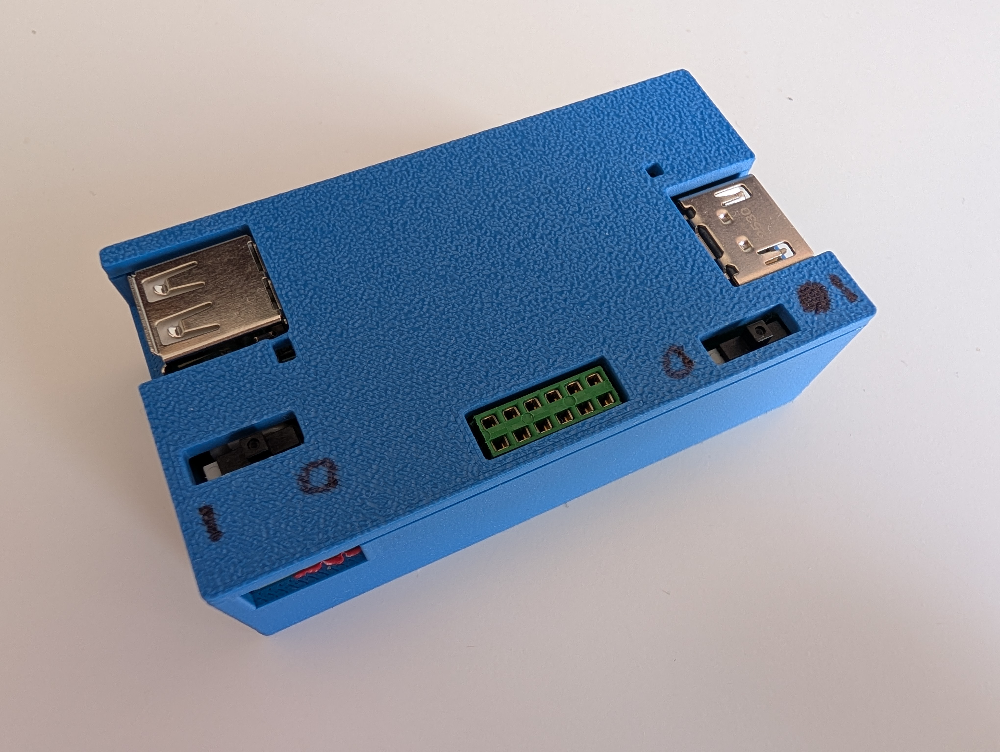
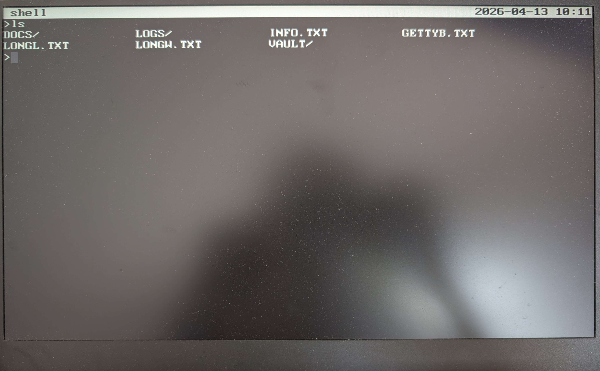

# PicoTop

PicoTop is a small computer and operating system built around the RP2350. It outputs a black and white terminal over HDMI and takes input from a USB keyboard. It runs its own keyboard-only OS with a shell, text editor, and a small set of programs. "PicoTop" is like laptop, except this one requires you to BYO monitor and keyboard... so not really a laptop at all. I came up with the name before a project pivot.

![PicoTop PCB]{Images/PicoTopBoard.jpg)

## Features

- **HDMI out** - 640x480 terminal display over DVI
- **USB keyboard** - standard USB-A keyboard input
- **Rechargeable** - onboard LiPo battery with USB-C charging; battery level visible in the top bar
- **SD card file system** - FAT16 on a micro SD card (FAT16 only; cards must be 2GB or smaller. I have only tested 2GB and 512MB)
- **RTC** - onboard real-time clock keeps time across power cycles
- **Exposed Pins** - 10 female headers expose 3V3, GND, I2C, UART, and two GPIO pins
- **Vault** - A system to encrypt a 'vault' folder in the file system

## Programs

| Program | Description |
|---|---|
| `shell` | Command-line interface; entry point for all programs and commands |
| `uEdit` | Text editor |
| `calc` | Calculator workbook |
| `hangman` | Hangman game |

### Shell Commands

`history`, `debug-log`, `timeset`, `battv`, `beep`, `clear`, `ls`, `pwd`, `cd`, `mkdir`, `rmdir`, `rm`, `cp`, `mv`, `sd-format`, `sd-mount`, `sd-unmount`, and GPIO interaction commands. All commands have a `-h` option to describe what they do and how to use them.

## Repo Contents

- HARDWARE/ has the schematics and PCB for the computer and the case .stl files to 3D print the case.
- SOFTWARE/ has all the code. Open that with VS Code and the Pico SDK plugin and build/upload the "shellwork" project.

## Notes

This FAT16 file system does NOT support LFN (Long File Names). It strictly uses 8.3 naming; 8 characters for the file/folder name and 3 for the file/folder extension.

This repository is not used for active development, so everything is in one commit. It will be updated again at the next major milestone.

I am not great at coding, so you will probably find a lot of bad practices and bugs, but I am mostly happy with where the project is right now. I used AI to help write a few snippets and also help with the certain architectures, like for the file system and the text editor.

## More Images

PicoTop in its 3D printed case

Shell program showing the `ls` command. You can see the VAULT/ folder and that all files and folders follow the 8.3 FAT16 naming convention.